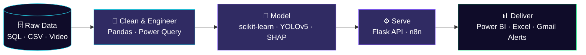
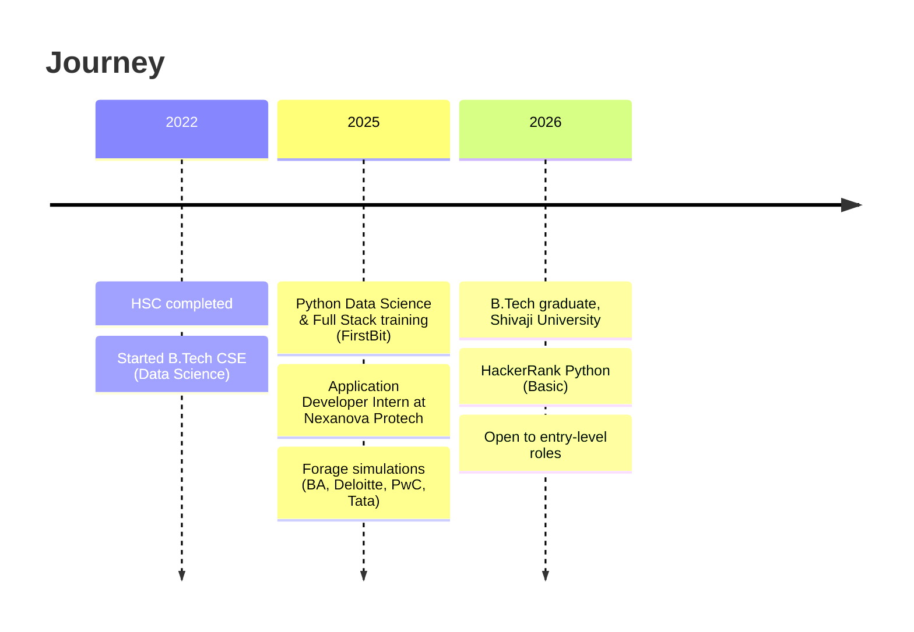

<!-- ============ HEADER ============ -->
<div align="center">


<a href="https://git.io/typing-svg"></a>

<br/>


<br/><br/>

<a href="https://www.linkedin.com/in/ganesh-ingale-engineer"></a>
<a href="mailto:ganeshingale9699@gmail.com"></a>
<a href="https://github.com/ganeshingale96?tab=repositories"></a>

</div>

<br/>

<!-- ============ TERMINAL ============ -->
## `>_` whoami

```python
class GaneshIngale:
    role      = ["Python Developer", "Data Analyst", "AI/ML Engineer"]
    education = "B.Tech CSE (Data Science), Shivaji University — 2026"
    location  = "Pune, India"
    internship = "Application Developer @ Nexanova Protech (Jul–Dec 2025)"

    focus = {
        "python":    "backend modules, Django / Flask, SQL-driven apps",
        "analytics": "SQL, Power BI, DAX, EDA, KPI dashboards",
        "ai_ml":     "OpenCV, YOLOv5, scikit-learn, SHAP, n8n + ML APIs",
    }

    currently_learning = ["Deep Learning (ANN, CNN)", "Django REST Framework"]
    philosophy = "Raw data -> insight -> working system."

    def open_to(self):
        return "Entry-level Python / Data / AI-ML roles"
```

<!-- ============ PIPELINE ============ -->
## 🧬 How I Work



<!-- ============ STACK ============ -->
## ⚡ Tech Arsenal

<div align="center">


<br/>

<br/>

<br/><br/>


</div>

<details>
<summary><b>📚 Full skill matrix</b></summary>
<br/>

| Domain | Skills |
|---|---|
| **Programming** | Python, SQL, JavaScript (Basic), HTML5, CSS3, OOP |
| **Backend** | Django, Flask, REST API, CRUD |
| **Databases** | MySQL, PostgreSQL, SQLite · Joins, Subqueries, CTEs, Window Functions, Normalization |
| **Data & BI** | Pandas, NumPy, EDA, Statistics, Power BI, DAX, Power Query, Excel, Matplotlib, Seaborn |
| **ML & AI** | Regression, Classification, Clustering, ANN, CNN, Feature Engineering, Model Evaluation, SHAP |
| **Computer Vision** | OpenCV, YOLOv5, face_recognition |
| **Automation** | n8n, Webhooks, API Integration, Excel Report Automation |
| **Tools** | Git, GitHub, VS Code, Jupyter Notebook |

</details>

<!-- ============ PROJECTS ============ -->
## 🚀 Mission Log — Featured Projects

### 🤖 AI · ML · Computer Vision

<table>
<tr>
<td width="50%" valign="top">

#### 🧑‍💼 [SmartHireX-AI](https://github.com/ganeshingale96/SmartHireX-AI)
Predicts hiring probability and uses **SHAP** to explain the top factors behind every prediction, with confidence scores and percentile ranking.

`Python` `Scikit-learn` `SHAP`

</td>
<td width="50%" valign="top">

#### 👁️ [EyeMark](https://github.com/ganeshingale96/EyeMark)
Anti-proxy attendance using **128-D face embeddings** for real-time verification, a `UNIQUE(roll_no, date)` integrity constraint, and automated daily Excel reports.

`Python` `OpenCV` `face_recognition` `SQLite` `Pandas`

</td>
</tr>
<tr>
<td width="50%" valign="top">

#### 🚦 [Smart Traffic Management](https://github.com/ganeshingale96/Smart-traffic-managment-TY-project-)
Detects, classifies and counts vehicles from live video with **YOLOv5**, then adapts signal timing to live traffic density.

`Python` `OpenCV` `YOLOv5` `Deep Learning`

</td>
<td width="50%" valign="top">

#### 🔗 [AI Workflow Automation (n8n)](https://github.com/ganeshingale96/AI-Powered-Workflow-Automation-using-n8n)
Webhook → validate & clean → IF/Switch routing → **Flask ML API** → predictions to Google Sheets, with automated Gmail alerts and daily summaries.

`n8n` `Python` `Flask` `Webhooks` `REST API`

</td>
</tr>
</table>

### 📊 Data Analytics

<table>
<tr>
<td width="33%" valign="top">

#### 🛍️ [RetailPulse](https://github.com/ganeshingale96/RetailPulse)
Customer behavior dashboard: KPI cards, regional analysis, dynamic slicers.

`Power BI` `DAX` `Power Query`

</td>
<td width="33%" valign="top">

#### 🛒 [Blinkit Sales Analysis](https://github.com/ganeshingale96/Blinkit_Sales_Analysis_PowerBi)
Sales trends, product performance and revenue patterns from cleaned data.

`Power BI` `Data Cleaning`

</td>
<td width="33%" valign="top">

#### 🗄️ [TY Database Project](https://github.com/ganeshingale96/TY-Database-Project)
Normalized relational schemas with complex joins, subqueries, aggregations.

`SQL` `Database Design`

</td>
</tr>
</table>

### 🐍 Python & Full Stack

<table>
<tr>
<td width="33%" valign="top">

#### 📚 [Library Management System](https://github.com/ganeshingale96/Library-Management-System)
CRUD app automating issue, return and stock tracking on a normalized MySQL schema.

`Python` `MySQL`

</td>
<td width="33%" valign="top">

#### ✈️ [Tourism Management System](https://github.com/ganeshingale96/Tourism-Management-System-Pure-Python)
Admin and Customer modules, file-based authentication, reports.

`Python` `OOP`

</td>
<td width="33%" valign="top">

#### 🧮 [Apple Mobile Calculator](https://github.com/ganeshingale96/Apple-mobile-calculator)
Responsive mobile-style web calculator.

`HTML` `CSS` `JavaScript`

</td>
</tr>
</table>

<!-- ============ EXPERIENCE ============ -->
## 🛰️ Experience Timeline



**Application Developer Intern — Nexanova Protech Pvt. Ltd.** · *Jul 2025 – Dec 2025*
- Developed and maintained Python-based backend modules supporting structured data processing workflows.
- Collaborated using SDLC practices and Git version control in an agile workflow.

## 🏅 Credentials

| | |
|---|---|
| 🎓 **B.Tech CSE (Data Science)** | Shivaji University, Kolhapur · 2026 · CGPA 7.45 |
| 📜 **FirstBit Certified Professional** | Python Data Science with Fullstack (Jul 2025 – Feb 2026) |
| 🐍 **HackerRank** | Python (Basic), Jul 2026 |
| 💼 **Forage Simulations** | British Airways · Deloitte · PwC · Tata (×2) |

<!-- ============ ANALYTICS ============ -->
## 📡 Live Telemetry

<div align="center">


<!-- Contribution snake: needs the workflow in .github/workflows/snake.yml -->
<picture>
  <source media="(prefers-color-scheme: dark)" srcset="https://raw.githubusercontent.com/ganeshingale96/ganeshingale96/output/github-snake-dark.svg"/>
  
</picture>

</div>

<!-- ============ FOOTER ============ -->
<div align="center">

<br/>

```
┌──────────────────────────────────────────────┐
│  > Turning data into insight, and insight    │
│    into systems that work.                   │
└──────────────────────────────────────────────┘
```


</div>
